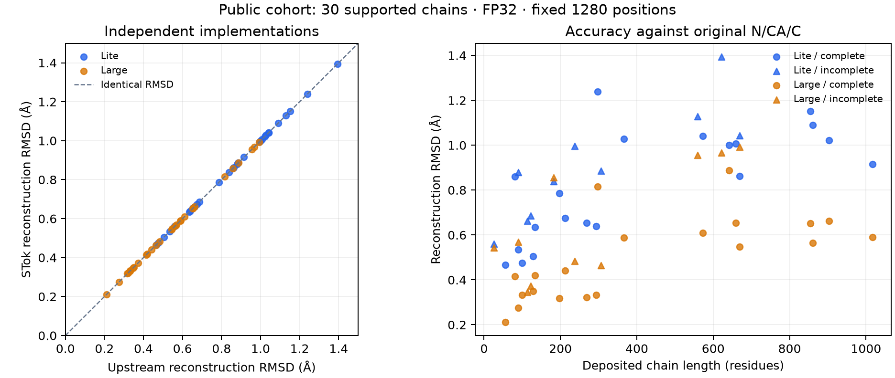

# Public encoder/decoder roundtrip comparison — October 1, 2026

Both STok and the pinned upstream GCP-VQVAE implementation ran their complete released encoder → vector quantizer → geometric decoder stacks on the existing 40-chain public cohort, for both Lite and Large. Thirty chains are within the existing inference coverage limits; ten were excluded by those same limits in both model runs. The accepted set contains 20 complete and 10 incomplete chains, with 11,236 originally observed, label-available residues per model.

**Both implementations produced exactly identical available token IDs and reconstructed N/CA/C coordinates in every accepted case. Mean backbone reconstruction RMSD to the original inputs was 0.855 Å for Lite and 0.551 Å for Large.** No agreement or accuracy threshold was introduced; these are measurements.



## Reconstruction accuracy

Values below are unweighted means of per-chain RMSD in Å, after optimal proper rigid Kabsch alignment over all scored N/CA/C atoms. CA-only RMSD uses an independent CA fit. Original source coordinates are the targets; imputed or corrected working coordinates never become targets. Only originally available N/CA/C/O rows with decoded labels are scored. Missing positions remain unscored NaN outputs, so this does not evaluate missing-loop recovery.

| Group | Chains | Lite: STok / upstream backbone RMSD | Large: STok / upstream backbone RMSD | Lite CA RMSD | Large CA RMSD |
|---|---:|---:|---:|---:|---:|
| All | 30 | 0.855191 / 0.855191 | 0.551236 / 0.551236 | 0.866011 | 0.556273 |
| Complete | 20 | 0.829214 / 0.829214 | 0.499325 / 0.499325 | 0.840825 | 0.503383 |
| Incomplete | 10 | 0.907147 / 0.907147 | 0.655059 / 0.655059 | 0.916381 | 0.662052 |
| Selection | 17 | 0.891295 / 0.891295 | 0.556820 / 0.556820 | 0.902690 | 0.561734 |
| Heldout | 13 | 0.807980 / 0.807980 | 0.543934 / 0.543934 | 0.818046 | 0.549132 |

Across all accepted chains, Lite's median backbone RMSD is 0.871 Å and its range is 0.466–1.395 Å; Large's median is 0.546 Å and its range is 0.211–0.992 Å. Complete-chain means are 0.829 Å for Lite and 0.499 Å for Large. Per-chain values and every exclusion are in [the CSV](public-roundtrip-chains.csv); full mean/median/range summaries, runtime and provenance are in [the JSON](public-roundtrip-results.json).

## Implementation consistency

For each model, 30 complete encoder/quantizer/decoder runs compared 11,236 available token IDs and 33,708 reconstructed backbone atoms. Changed token IDs: **0**. Maximum unaligned coordinate displacement between implementations: **0 Å**. Thus agreement was observed before any alignment; the similarity is not an artifact of separately fitting both reconstructions. Independently produced filled/recentered working coordinates also matched. This observation is bounded to these released models, inputs and runtime, rather than a new universal exactness requirement.

The source correspondence adapter is intentionally shared: both receive the same deposited polymer positions, original observations, and native observed identities (X at unresolved positions). Upstream's unmodified `DemoStructureDataset.__getitem__`, filling, graph/collation/featurization and full `SuperModel` then run independently of STok's preparation and model code. We bypass its coordinate-parser author-number-gap heuristic so differences in residue mapping do not confound the model comparison. This verifies both complete model stacks; it is not a claim that their raw-file parsers implement identical policies.

Both encoder and decoder use 1280-position singleton FP32 tensors with autocast disabled on Radeon 8060S, torch2.14.0+rocm7.2, HIP7.2.53211 and SDPA. The source is the clean upstream commit `68c4c284fe204de27fdf61db27fcc01136ea9f28`; all checkpoint/config bytes match the immutable released artifacts. Upstream loads strictly through the existing reference loader, with only the same five unused Large auxiliary head tensors excluded. The report records exact versions, code/source hashes and artifact digests.

## What this says about published accuracy

The [official GCP-VQVAE repository](https://github.com/mahdip72/vq_encoder_decoder#abstract) reports benchmark backbone RMSDs of 0.4377 Å on CAMEO2024, 0.5293 Å on CASP15, 0.7567 Å on CASP16, and 0.8193 Å on its zero-shot experimental set. Large's 0.551 Å here, including 0.499 Å on complete chains, supplies additional evidence of sub-angstrom reconstruction on this public sample. Lite also remains below 1 Å on average, at 0.855 Å.

This is additional evidence, not reproduction of those benchmark means: the cohort and aggregation differ, pretrained-training overlap is unknown, and alignment/scoring conventions must be matched for exact cross-paper comparisons. We report both proper Kabsch backbone and CA RMSDs. The pinned upstream demo's TM-score evaluator instead selects CA atoms and optimizes a TM-score alignment. The existing selection/held-out split is preserved, although both parts are used in this additional verification.

Seven chains exceed the existing 15-residue missing-block limit and three exceed the 20% missing-row limit. All ten remain listed in the CSV, rather than being dropped from the attempted count. These results describe the 30 supported chains, not reconstruction of all 40 entries or unobserved residues.

## Replay and saved evidence

From a repository checkout with the existing reference environment and local immutable release archives:

```bash
PYTHONPATH=src:. OMP_NUM_THREADS=1 python -m experiments.gcp_vqvae_roundtrip \
  --reference /path/to/pinned-vq_encoder_decoder \
  --weights /path/to/released-checkpoints \
  --output /path/to/new-roundtrip-output --device cuda:0
```

The [runner](../../../experiments/gcp_vqvae_roundtrip.py) uses the existing reference loader and Biopython's SVD superimposer; no production inference code changes. One metric check verifies proper rigid alignment, exclusion of masked NaN targets, and preservation of chirality. A separate audit reloaded all 60 saved prediction arrays, checked their hashes, original source coordinates/atom masks/score masks, exact IDs/coordinates, and recomputed RMSDs. Raw NPZ arrays and operational logs are retained locally under `downloads/gcp-vqvae-public/roundtrip-2026-10-01/`; the summary, all chain results and [vector figure](public-roundtrip-rmsd.svg) are committed here.
